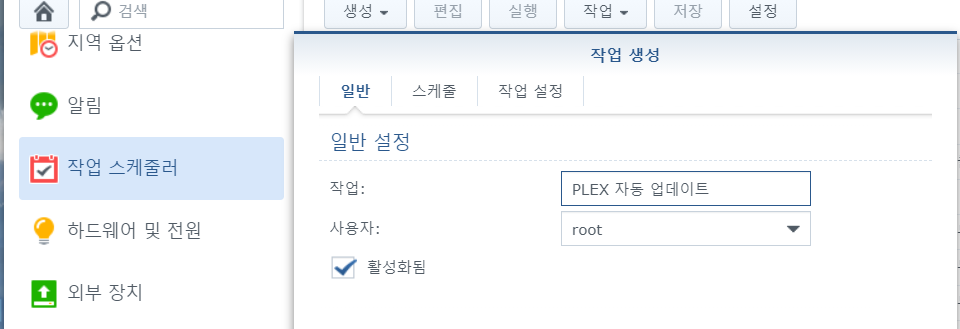
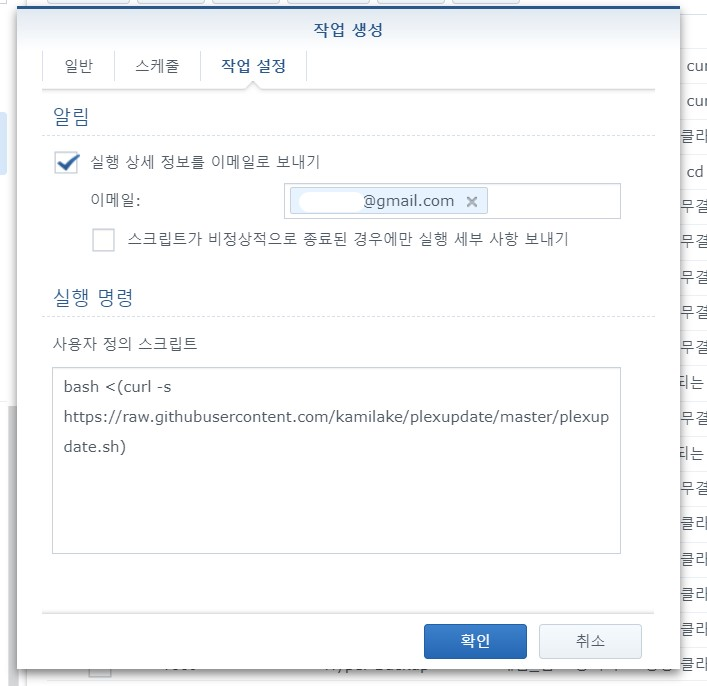

# 설명
Synology NAS에서 자동으로 Plex 미디어 서버를 업데이트합니다

# 사용방법

Synology DSM의 작업 스케줄러에 다음 작업을 추가해주세요
<div align="center">
  
</div>

```bash
bash <(curl -s https://raw.githubusercontent.com/kamilake/plexupdate/master/plexupdate.sh)
```

<div align="center">
  
</div>
이제 업데이트 주기를 적당하게 (매일 새벽 4시 등) 설정하면 됩니다.

<br><br>

> Thanks to https://forums.plex.tv/u/j0nsplex
> 
> Thanks to https://forums.plex.tv/t/script-to-auto-update-plex-on-synology-nas-rev6/479748
